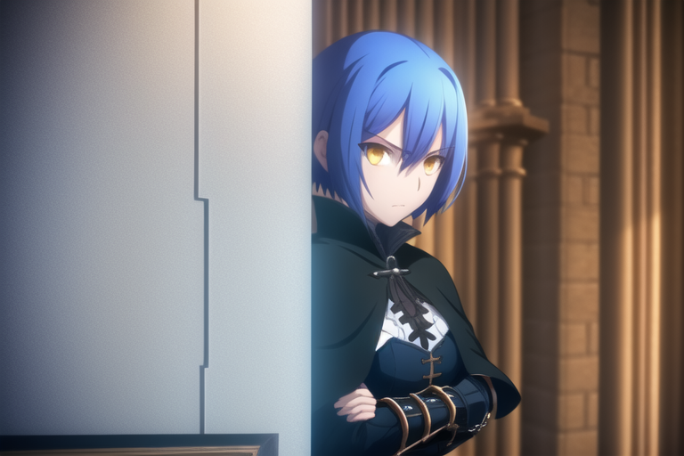

icon:material/information-variant
# About Diffusion Design Works


Diffusion Design Works is a Stable Diffusion model series created with the goal of producing AI Art Generations with illustration styles mimicking the look and quality of studio produced Japanese animations.

## How is this different from other LoRAs?

They are not a LoRA, but full checkpoints!

[LoRAs](https://arxiv.org/abs/2106.09685), while effective in introducing new concepts on an already trained main model in a non destructive way, can be inflexible if not trained properly. If running multiple different LoRAs, trained by different people of unknown skill or ability, will cause produce inconsistent final outputs in terms of quality and final content. Other "full checkpoints" that similarly go about recreating popular artists’ and media’s styles will train a LoRA based network on that content to then merge into an SD1.x, Novel AI, or SDXL base checkpoint, which is not normally allowed in basic SD model merge tools, through the use of something like [SuperMerger](https://github.com/hako-mikan/sd-webui-supermerger). This merge is destructive, and will disrupt all the unet layers, making the final product produce different results than if the LoRA's were just injected during the generative process. 

By finetune new concepts and info from the very start, the model will have better flexibility in prompting, consistent results visual and quality results across all generations, and can be used with other extensions such as Controlnet or AnimateDiff that may struggle to incorporate generating content while additional networks are enabled.

----

## Text to Image Models

### [Unlimited Diffusion Works](pages/udw/udwmodel.md)

A television anime quality themed Stable Diffusion 1.4 based AI art model

[{: style="width:340px"}](./images/t2i/udw/104188-2819849585.png)
[{: style="width:340px"}](./images/t2i/udw/107011-4194903623.png)
[{: style="width:340px"}](./images/t2i/udw/107115-3621427120.png)
[{: style="width:340px"}](./images/t2i/udw/107574-2339296326.png)

Trained in the likeness of production studio ufotable's works, the model is finetuned over Novel AI with 200K images. The generated art gives the feel and quality of official artwork or screenshots from a television series, most notably the adapted works of Type-Moon.

??? abstract "Img2Img Movie Poster Example + Inpaint time lapse"

    [{: style="width:340px"}](./images/t2i/udw/i2i/BrotherhoodWolf.png)
    [{: style="width:340px"}](./images/t2i/udw/i2i/00474-3492909164.png)
    [{: style="width:680px"}](./images/t2i/udw/i2i/posterimg2img.gif)
    ```
    Steps: 30, Sampler: DPM++ 2M Karras, CFG scale: 8, Size: 608x896, Denoising strength: 0.6, Clip skip: 2
    ```

----

## Text to Video Models

### [Motion Model Diffusion](pages/motion/motiondiffusion.md) 

AnimateDiff Stable Diffusion Plug In to create Text to Video

[{: style="width:340px"}](./images/t2v/motion/00109-3896167239.png)
[{: style="width:340px"}](https://files.catbox.moe/8ts0hn.webm)
[{: style="width:340px"}](./images/t2v/motion/83324-3762605540.png)
[{: style="width:340px"}](./images/t2v/motion/83324-3762605540-RIFE.gif)


<span style="font-size: 80%;">*An indepent motion model finetune is possible, see page for information*</span>

AnimateDiff is a seperate motion video model that integrates the unet block information of the loaded model to generate the individual frames that then get joined together into an animation.
??? abstract "Animation + Contact Sheet of frames"

    [{: style="width:680px"}](./images/t2v/motion/00312-1092277290-RIFE.gif) 
    [{: style="width:680px"}](./images/t2v/motion/ContactSheet-002.png)
