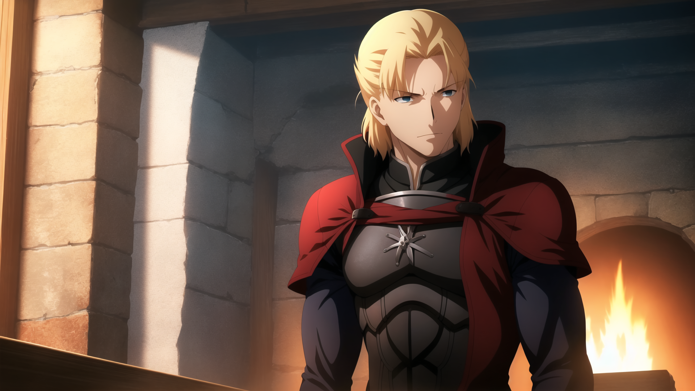

icon:material/information-variant
# About Diffusion Design Works

Diffusion Design Works is a Stable Diffusion model series created with the goal of producing AI Art Generations with illustration styles mimicking the look and quality of studio produced Japanese animations.

## What's Different from other LoRAs?

They are not a LoRA, but full checkpoints!

What separates this model project from other checkpoints that similarly go about recreating popular artists’ and media’s styles lies mostly on a larger, higher fidelity dataset and an emphasis on doing a full finetune training rather than training a LoRA based network that then gets merged into an SD1.x, Novel AI, or SDXL base checkpoint, giving it better flexibility with the use of other extensions such as Controlnet or AnimateDiff that may struggle to incorporate generating with additional networks enabled.

----

## Text to Image Models

### Unlimited Diffusion Works

A television anime quality themed Stable Diffusion 1.4 based AI art model

[{: style="width:340px"}](./images/104188-2819849585.png)
[{: style="width:340px"}](./images/107011-4194903623.png)
[{: style="width:340px"}](./images/107115-3621427120.png)
[{: style="width:340px"}](./images/107574-2339296326.png)

Trained in the likeness of production studio ufotable's works, the model is finetuned over Novel AI with 200K images. The generated art gives the feel and quality of official artwork or screenshots from a television series, most notably the adapted works of Type-Moon.

??? abstract "Img2img example and time lapse"

    [{: style="width:340px"}](./images/BrotherhoodWolf.png)
    [{: style="width:340px"}](./images/00474-3492909164.png)
    [{: style="width:680px"}](./images/posterimg2img.gif)

<span style="font-size: 80%;">*Img2Img Movie Poster + Inpainting Upscale*</span>
```
Steps: 30, Sampler: DPM++ 2M Karras, CFG scale: 8, Size: 608x896, Denoising strength: 0.6, Clip skip: 2
```
----

## Text to Video Models

### Motion Model Diffusion 

AnimateDiff Stable Diffusion Plug In to create Text to Video

{: style="width:340px"} <iframe src="https://files.catbox.moe/8ts0hn.webm" width= "340" height= "226.5" frameborder="0" allow="fullscreen"></iframe>

AnimateDiff is a seperate motion video model that integrates the unet block information of the loaded model to generate the individual frames that then get joined together into an animation.
??? abstract "Animation + Contact Sheet of frames"

    [{: style="width:680px"}](./images/00312-1092277290-RIFE.gif) 
    [{: style="width:680px"}](./images/ContactSheet-002.png)
