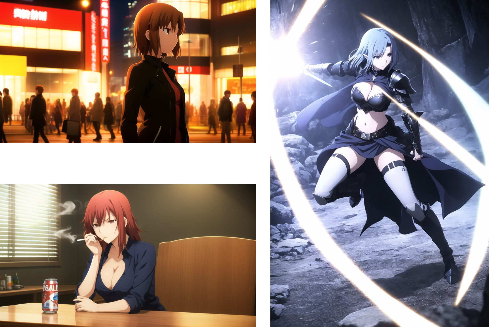
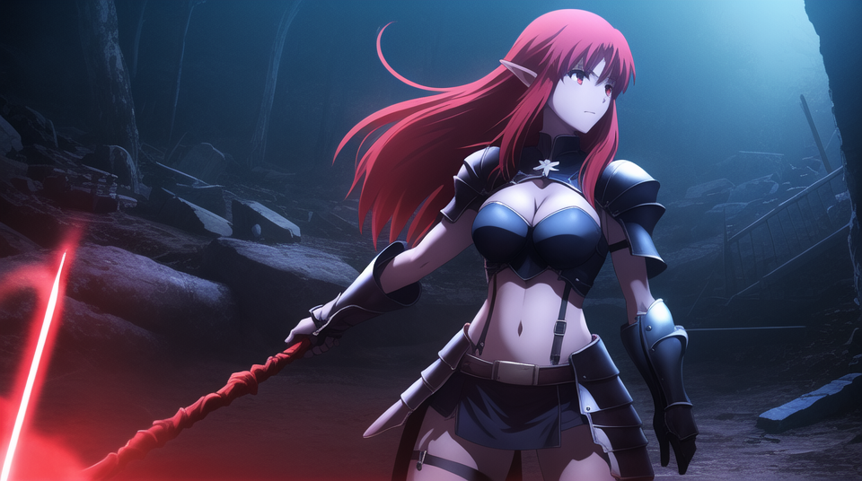

icon:fontawesome/solid/photo-film
# Local Video Motion Model

As Text to Video has taken its first steps into mainstream with products such as Luma, interest in making this kind of AI content has grown, and there have been some groups that have made attempts in making video models for local applications in the open source space that integrate with Stable Diffusion.  

----
## AnimateDiff

[AnimateDiff](https://github.com/guoyww/AnimateDiff) is a plug-and-play module that will take T2I prompts and use the motion model to create short animation video clips with Stable Diffusion. This was created back in June 2023.

One of the issues as to why this never picked up much steam, aside from its incompatibility with SDXL at the time, is that there was no clear way or instruction to make the video generations do what you want. Had to bruteforce your way into a result and sometimes you just settled for what you got. The hardware requirements were also much higher, most people could only make 256x256 to about 384x384 clips and the generations would take 10 to 15 minutes to generate. They also could not be upscaled without running out of memory. 

### AnimateDiff + UDW Examples

[{: style="width:344px"}](./images/00175-2176596798-RIFE.gif)
[{: style="width:344px"}](./images/00372-1258236320-Flip-RIFE.gif)

[{: style="width:170px"}](./images/00080-345913690-RIFE.gif)
[{: style="width:170px"}](./images/00106-2140579446-RIFE.gif)
[{: style="width:170px"}](./images/00404-1652022638-RIFE.gif)
[{: style="width:170px"}](./images/00427-2950972036-RIFE.gif)

*[Reaniamted with Flowframes](https://github.com/n00mkrad/flowframes) - RIFE 4.0 @ 20 FPS*

While fortunate enough to have a 4090 and able to generate 768x512 clips, they still took a significant amount of time to train and were still prone to failing mid generation if there was some sort of hiccup for the bleeding edge tech at the time. There is some optimizations since then, more GPU VRAM is require to do higher resolutions, hires upscales, and longer generations.

!!! info ".gif outputs"

    One other drawback to AnimateDiff is that outputs are generated in a very low bit gif format and around 8FPS by default, but you have access to all your generated frames at their maximum generated quality, so you could reanimate them in third party software or output into a better file container like mp4 or webm at higher quality clip at a better frame rate. 

----
## Luma (and other AI Video platforms)

Services like Luma do have a better quality to their video generations, even when generating off an image for Img2Vid. While short in length, they are still longer than animatediff and maintain better quality by default as far as the platform is doing additional work in background. 

### Luma Img2Vid Examples

*Starting Source Images*
[{: style="width:680px"}](./images/LumaOriginals.png)

*Generated Results for Img2Vid*
<iframe src="https://files.catbox.moe/csbue6.mp4" width= "340" height= "188" frameborder="0" allow="fullscreen"></iframe>
<iframe src="https://files.catbox.moe/9zzjt4.mp4" width= "340" height= "188" frameborder="0" allow="fullscreen"></iframe>
<iframe src="https://files.catbox.moe/4kj2le.mp4" width= "680" height= "376" frameborder="0" allow="fullscreen"></iframe>
<iframe src="https://files.catbox.moe/uy046a.mp4" width= "340" height= "460" frameborder="0" allow="fullscreen"></iframe>
<iframe src="https://files.catbox.moe/4on3o8.mp4" width= "340" height= "460" frameborder="0" allow="fullscreen"></iframe>

But being restricted to their base model and their training may produce unintended results. Using their enhance prompt feature will deviate from your image almost entirely if your image is based on something their model is not trained on. If you focus exclusively on Text to Video, its not a bad platform, but if you want more control over the content you want to create with what you have, we would have to look else where.

??? Warning "Example of non-consistent Img2Vid"
    [{: style="width:684px"}](./images/106696-3973067177.png)

    <iframe src="https://files.catbox.moe/rqfivc.mp4" width= "340" height= "188" frameborder="0" allow="fullscreen"></iframe>
    <iframe src="https://files.catbox.moe/cyiac9.mp4" width= "340" height= "188" frameborder="0" allow="fullscreen"></iframe>
    
----

## Homebrew Potential

Sometime this year, the developers of AnimateDiff disclosed their training method, and since then only one decent finetune fork was created where the training resolution was doubled, but no new data was added due a lack of video tagging tools. While not a significant leap, it shows that enthusiasts are interested in pursuing this tech. With the visibility of the video dataset now clear, the path is open for those that have the hardware to finetune the motion model. 

[WebVid10M](https://github.com/m-bain/webvid) [(Mirror for education purposes)](https://huggingface.co/datasets/TempoFunk/webvid-10M), is comprised of low-resolution watermarked previews of shutterstock footage run through their own classifier as part of a larger project the group worked on. With a good stating off point, my existing pipeline for SD can be adjusted to incorporate new video clips, need only to use their Video trainer `Video2dataset` and repurpose the media rips I already have.

----

## Theoretical Pipeline

Since specific tuning is not required, we are open to using more types of movies, recordings, and other animations not necessarily related to official films and shows or even the ones we are using. 

Say we have access to a collection of videos. What we can create a [script that will generate timestamps](https://www.youtube.com/watch?v=nOeaFEHuFyM), similar to chapter select codes for Blu-Rays or steaming services, to mark every time there is a jumpcut to a new scene or camera shot. This will get written onto a sidecar file. 
Then with ffmpeg, use the video clip command with the sidecar automate the video clips slices. These clips will then be tagged and captioned and can be organized within Hydrus (Hydrus also can organize video format files) and use the same image organization tools to manually review tags and captions every time we need to train the model. 

!!! tip "Potential Prompting Improvement"

    * An addition step that can be performed to improve prompting results on the finetune is to introduce the Danbooru/Novel AI tag format as well as keeping the natural language captioning. Keeping the tagging consistent across both the main model and the motion model will cause less confusion for the final generation as both models will have a similar format to follow. 
    * A method to do this would be to take some frames from the peak of each clip, run the SD Tagger on it, and then apply those tags onto its corresponding video clip on Hydrus. 

Steps:

1. FFMPEG 
    * Create scene jump cut timestamp sidecar txt file from video 
    * Created segmented clips with ffmpeg 
2. Tagger (Video)
    * Run a video-based caption classifier on clips 
3. Tagger (Image - Optional)
    * Semi-automate additional Danbooru/NovelAI format tags 
        * Use frames from scenes to aggregate and average out compatible tags
4. Hydrus
    * Manual review dataset
6. Video2dataset
    * Export to trainer
7. Debug
    * Rinse and Repeat

From there it would be business as usual on the training front, depending on whether our local resources are sufficent to run the job ourselves.

----