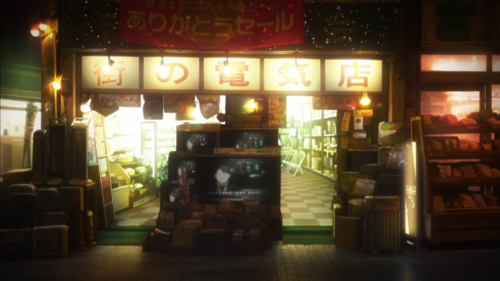
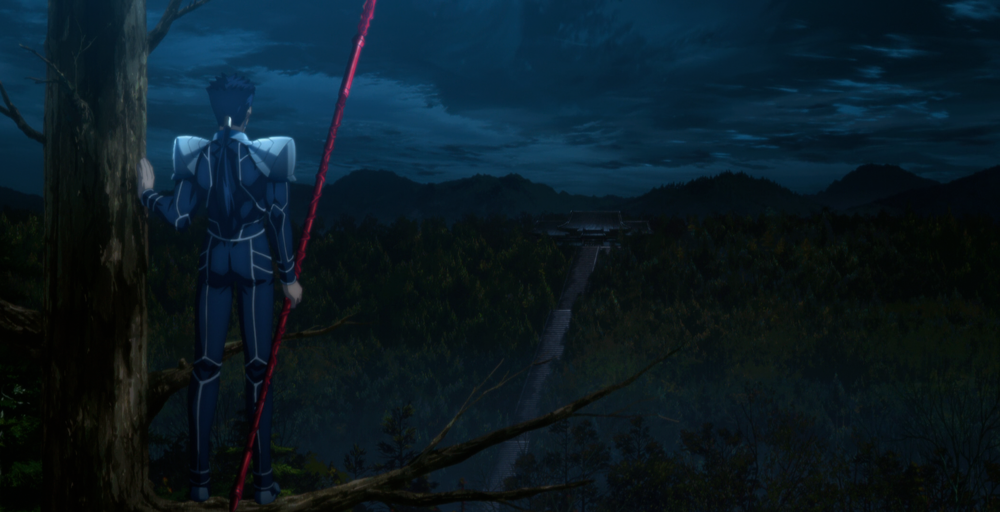

icon:material/account-box-edit-outline
# Dataset Post-Processing

There are 3 additional processes I do to my dataset that combat either certain flaws in the dataset, cleaning up data that could have production mistakes or bothersome editing choices, and maximize the amount of detail of specific shots or scenes: Layering, Cropping, and Stitching.

!!! info "Things to note before continuing:"
    
    * SD1.x is trained on 512x512 resolution images, a size of 262,144 Pixels

    * Novel AI continues training from SD1.4 with 768x768 resolution images, a size of 589,824 Pixels

    * SDXL is trained on 1024x1024 resolution images, a size of 1,048,576 Pixels
    
    * Novel AI created [Aspect Ratio Bucketing](https://github.com/NovelAI/novelai-aspect-ratio-bucketing) to allow training images to be outside 1:1 aspect resolutions, but the image is resized to fit within the 1:1 training resolution's pixel count

    * Most enthusiasts’ LoRAs are still trained on 512x512 due to the averae person's hardware constraints but have [Aspect Ratio Bucketing incorporated for varied training resolution sizes](https://www.youtube.com/watch?v=0xswM8QYFD0).

## Layering

[{: style="width:680px"}](./images/datasetpostprocess/Layering/KnK-Scene.gif)

*Example scene from Garden of Sinners 7*

So I have this scene of store front backdrop with a lot of moving foreground pieces, but not a single frame has a clean shot of that backdrop. There appears to be enough frames to piece together separate parts of the images on top of each other, and mask out unwanted details, to create a clean backdrop image.  

[{: style="width:680px"}](./images/datasetpostprocess/Layering/KnK-Frame-Layer.gif)

*Layering the scene*

We start with a base frame that has the least amount of unwanted foreground pieces, then takes pieces of other frames that have the most negative space that show the store front, and start layering them on top of eachother until we get the clean backdrop. From there we reincorporate the base frame with a crop of the two main subjects into center focus so we can produce a backdrop frame with the subject for additional concept training.

[{: style="width:340px"}](./images/datasetpostprocess/Layering/KnK-7-Layered-BG.png)
[{: style="width:340px"}](./images/datasetpostprocess/Layering/KnK-7-Layered-BG-1boy1girl.png)

*Final Results*

Then the original frames are reintroduced into the dataset with the frames created to train the concept of being able to draw a location, and that same spot with moving crowds or objects in the foreground. This is not something I prioritize often, but when a particular scene with too many moving pieces shows up that I feel is worth doing the work produce, I will set that scene aside to make an attempt later.

----

## Stitching

[{: style="width:340px"}](./images/datasetpostprocess/Stitching/Scene/fz-excaliblast.gif)
[{: style="width:340px"}](./images/datasetpostprocess/Stitching/Scene/fsn-redman.gif)
[{: style="width:340px"}](./images/datasetpostprocess/Stitching/Scene/fz-firearms2.gif)
[{: style="width:340px"}](./images/datasetpostprocess/Stitching/Scene/hf-culandscape.gif)

*Example scenes from Fate Zero, Unlimited Blade Works, and Heaven's Feel*

In any sort of motion picture, you will get scenes where the camera is panning from one direction another to either show off a landscape shot, or a character’s reveal a sizing up of several characters in the prelude to a confrontation. Most of these frames by themselves wouldn't be useful, but merging them to create a full image would give better concept training than a mass of images the model would have no way to assemble on its own, let alone any understanding of what it's looking at.

[{: style="width:340px"}](./images/datasetpostprocess/Stitching/Stitch/FZ_OP1_1858-Pano.png)
[{: style="width:340px"}](./images/datasetpostprocess/Stitching/Stitch/FSN_UBW_0_22074-Pano.png)
[{: style="width:680px"}](./images/datasetpostprocess/Stitching/Stitch/FZ_3_24233-Pano.png)
[{: style="width:680px"}](./images/datasetpostprocess/Stitching/Stitch/FSN_HF_1_133709-Pano.png)

*Frames stitched up into full images*

 Simply importing the frames to Photoshop or Lightroom and use either manual or automated tools to assemble the pieces together will create a good quality image. The full image in non-bluray aspect ratios will also give the model additional resolutions to train on to improve generations outside the standard sresolutions and reduce potential overfit that can be caused by training almost exclusively on 16:9 resolution images.

!!! bug "Parallaxing"
     There may be issue with stitching up images due to parallaxing between foreground, background, and other objects. So not only will there be cases where one must manually make adjustments when automation fails, but also judge which set pieces need to be the anchor points to line up the other images and mask out incompatible details similar to how the layering example is done.

----

## Cropping

[{: style="width:340px"}](./images/datasetpostprocess/Cropping/Scene/hf-sakuraupset.gif)
[{: style="width:340px"}](./images/datasetpostprocess/Cropping/Scene/hf-iliyaspin.gif)

*Example scenes from Fate Heaven's Feel 2*

While originally a requirement to make 1:1 crop cutouts of images for your dataset in the early days of Stable Diffusion Dreambooth training, the introduction and source code release for Aspect Ratio Bucketing by NovelAI allowed the use of any resolution size for datasets and would be sized to fit a resolution bucket for training. 

This crop and resizing down of the full images however will cause a loss in detail of the image as the bucket still needs to comply with the 1:1 aspect pixel size, and those buckets will always have a lower pixel count than the default training resolution, so a large image like a 1920x1080 blu-ray frame or any other 2MP image from an imageboard getting crunched down will cause the model to lose out on information detail. 

[{: style="width:680px"}](./images/datasetpostprocess/Cropping/Sheets/crop-sheet.png)

*Expressions made into individual cropped images*

To remedy this, I also include sizable amount of 1:1 aspect images. These focus on facial expressions, certain detail focus shots of objects and items, character’s extremities to improve hand and finger accuracy, or close ups of clothing and/or patterns. I will also use this on the same frames of stitches I created, if possible, to also preserve those details of panning shots. The 1:1 aspect images also help in reducing overfit from the main resolution.

----
