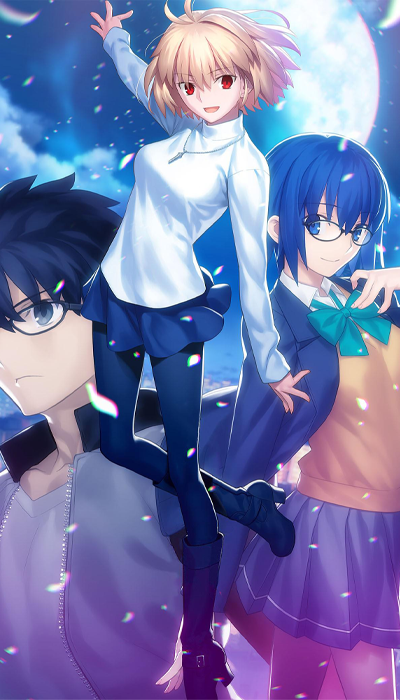

icon:material/update
# Status Update + To Do List

## 08/2024

### Content Update

#### ufotable Key Animation Collections

I ironically mentioned in a previous update that these Key Animations were likely going to be low priority in acquiring because there are too many of them, very expensive to obtain, and no cases I was aware of where anyone ever scanned their collection to show off these rare box sets... until about a couple days ago as of this writing. Someone scanned several of these animation key frames books. Unfortunately they were scanned in [black and white](./images/todolist/artbook/keyframe/092.jpg), they should actually be [partially colored](./images/todolist/artbook/keyframe/UwZjAmaV.jpeg) to denote color separation and shading. The scans also did not contain the illustration cards, but I had some scans of them already, and some of the frames look like they came from another set of collections, but still match the theme. Nonetheless I will add them as they are absurdly high resolution with clear detailing, until I find the colored versions.

*Fate/Stay Night 'Unlimited Blade Works' Character Complete Key Animations 1st - 2nd Season Comiket C88 Banner*

!!! Tip "The following content to be added to a future training:"
    *   Artbook
        *   ufotable 
            *   Fate/Stay Night 'Unlimited Blade Works' Character Complete Key Animations #00 · #01
                * [Saber](./images/todolist/artbook/1182551.jpeg) - *[Sample](./images/todolist/artbook/keyframe/093.jpg)*
                * [Archer](./images/todolist/artbook/1182553.jpeg) - *[Sample](./images/todolist/artbook/keyframe/073.jpg)* - *[Illustration Card](./images/todolist/artbook/678218.jpg)*
                * [Toksaka Rin](./images/todolist/artbook/1182552.jpeg) - *[Sample](./images/todolist/artbook/keyframe/161.jpg)* - *[Illustration Card](./images/todolist/artbook/678217.jpg)* 
            *   Fate/Stay Night 'Unlimited Blade Works' Character Complete Key Animations 1st - 2nd Season
                * [Lancer](./images/todolist/artbook/55C0AA984A2C740018.jpg) - *[Sample](./images/todolist/artbook/keyframe/008.jpg)*
                * [Gilgamesh](./images/todolist/artbook/55C0AA964A025B0032.jpg) - *[Sample](./images/todolist/artbook/keyframe/064.jpg)*

#### Dataset Experiment

I'm also preparing a different kind of dataset sample from a Visual Novel that has almost fully animated sprites and cutscenes but are already seperated in frames. The game's engine would assemble all of the keyframes together in real time, so no need to frame extract the content. I would have to reassemble and animate the the scenes if I want to add it for the motion model's dataset when I attempt the finetune once UDW's next training is completed.

Will also make a point to try and get some Visual Novel assets from Witch on the Holy Night and Tsukihime prepared for this next training. Introduce the other main Type Moon artist's (Hirokazu Koyama) character designs that will be adapted in a new movie with the former, and reinforce the modern Takeuchi character designs already adapted by ufotable with the latter. The goal is to improve clean sprite resolution depictions of characters and that can be blown up to larger resolutions, using their ultra high resolution sources images (1200x5400 for example) that can be resized down or chopped up to fit various form of image composition sizes and have data for up close detailing.
                
## 07/2024

### Content Updates

#### Manual Review and Clean Up

!!! info "The following content in the current model is undergoing quality control and clean up:"
    * Fate Zero
        * *Episode 1-19 re-extracted, Episodes 1-3 and OP/ED 1 and 2 Completed, manual review and post work still in progress*
    * Fate Stay Night Unlimited Blade Works (TV)
        * *Episode 0-12 re-extracted, Episode 0-2 and OP/ED 1 and 2 Completed, manual review and post work still in progress*
    * Fate Stay Night Heaven’s Feel
        * *1 – presage flower: re-extracted, deduped and sorted, undergoing post-processing. manual review need*
        * *2 – lost butterfly: re-extracted, deduped and sorted, undergoing post-processing. manual review need*
        * *3 – spring song: re-extracted, duplicate removal and sorting in progress, some stitching completed*
    * The Garden of Sinners 
        * *8 – Epilogue: re-extracted, deduped and sorted, undergoing post-processing, manual review done*
        * *9 – Future Gospel: re-extracted, clean up in Progress, some stitching completed*
        * *9.5 Future Gospel – Extra Chorus: re-extracted, deduped and sorted, undergoing post-processing, manual review done*
    * Fate Stay Night [Réalta Nua]
        * *Opening Animations*
            * *re-extracted, deduped and sorted, undergoing post-processing. manual review need*
    * Fate/Hollow Ataraxia
        * *Opening Animations*
            * *re-extracted, deduped and sorted, undergoing post-processing. manual review need*

#### Ready To Train

[{: style="width:170px"}](./images/todolist//full/knk6.jpg)
[{: style="width:170px"}](./images/todolist/full/tozx.jpg)
[{: style="width:170px"}](./images/todolist/full/ktrfull.jpg)
[{: style="width:170px"}](./images/todolist/full/tob.png)

!!! success "The following content will be included in the next training session - minimal manual edits only:"
    *   Movies
        *   The Garden of Sinners 
            * 3 – Remaining Sense of Pain
            * 4 – The Hollow Shrine
            * 5 – Paradox Spiral
            * 6 – Oblivion Recorder
            * 7 – A Study in Murder - Part 2
    *   TV 
        *   Katsugeki/Touken Ranbu
        *   Tales of Zestiria the X  (Season 1)
    *   Video Games
        *   Tales of Zestiria
            * *Opening Animations and Cutscenes*
        *   Tales of Berseria
            * *Opening Animations and Cutscenes*
        *   Tsukihime -A piece of blue glass moon-
            * *Opening Animations*
    *   Mobile
        *   Fate Grand Order
            *   [The Garden of Sinners] crossover event
                * *ufotable assets and promotional animation only*
            *   [Fate Zero] crossover event
                * *ufotable promotional animation only*
            *   [Fate Stay Night - Heaven's Feel] movie premiere promotions
                * *ufotable assets only*

----

#### In Progress

[{: style="width:170px"}](./images/todolist//full/tsukire.jpg)
[{: style="width:170px"}](./images/todolist/full/mahoyofull.png)
[{: style="width:170px"}](./images/todolist/full/tos.jpg)
[{: style="width:170px"}](./images/todolist/full/kny.png)

!!! example "The following will be included in a future session - not ready, not ufotable content, lower priority, or limited disk space"

    *   Artbooks
        *   [The Garden of Sinners: The Animation by Ufotable](./images/todolist/artbook/81WRhFUmhFL._SL1500_.jpg)
            * *Have physical source, needs to be scanned*
        *   [The Garden of Sinners: Complete Illustration Art Book by Takeuchi Takashi](./images/todolist/artbook/9784062186971_w.jpg)
            * *Have physical source, needs to be scanned*

    *   Movies
        *   The Garden of Sinners 
            * 1 – Overlooking View
                * *Have source media, not extracted*
            * 2 – A Study in Murder - Part 1: 
                * *Have source media, not extracted*
        *   Tales of Symphonia
            * *Have not finalized a source*
        *   Demon Slayer - Mugen Train
            * *Have not finalized a source*
    *   TV
        *   Tales of Zestiria the X (TV - Season 2)
            * *Have source media, not extracted*
        *   Today's Menu for the Emiya Family  
            * *Have source media, not extracted*     
        *   Demon Slayer
            * *Have not finalized a source*
    *   Video Games
        *   Tales of Xillia I
            * *Openings and cutscenes extracted, Not sorted*
        *   Tales of Xillia II
            * *Openings and cutscenes extracted, Not sorted*
        *   Witch on the Holy Night
            * *Not ufotable, assembling in-game sprites and CG assets*
        *   Tsukihime -A piece of blue glass moon-
            * *Assembling non-ufotable in-game sprites and CG assets*
    *   Mobile
        *   Tales of Asteria 
            * *ufotable assets only*
        *   Tales of Crestoria
            * *ufotable assets only*

----

#### TBD

!!! failure "Waiting on USM decryption for the following games to frame extract cutscenes"
    *   Video Games
        *   Tales of Arise
            *   *Have usm video files on standby*

!!! failure "Awaiting sale or alternate source for follow collections"
    *   Artbook
        *   ufotable 
            *   [The Garden of Sinners - Seikaisha (Background Art Book)](./images/todolist/artbook/91vngIKYgCL._SL1500_.jpg)
            *   [The Garden of Sinners - Future Gospel New Years Illustrations Postcards [Comiket 85]](./images/todolist/artbook/000.jpg)
                * *A scan of this exists online but what looks to be dust or fuzz on the images from when it was scanned is obscuring fine details.*
            *   [Fate/Zero - Seikaisha (Background Art Book)](./images/todolist/artbook/91NlW-xGcBL._SL1500_.jpg)
            *   [Fate/Stay night 'Unlimited Blade Works' - Seikaisha (Background Art Book)](./images/todolist/artbook/9784062198738_w.jpg)
            *   [Fate/Stay Night 'Unlimited Blade Works' S1 - Settei Shiryoushuu (Setting Material) [Comiket 87]](./images/todolist/artbook/55C0AAA247644B001F.jpg)
            *   [Fate/Stay Night 'Unlimited Blade Works' S2- Settei Shiryoushuu (Setting Material) [Comiket 88]](./images/todolist/artbook/55C0AA9F470499000C.jpg)
            *   [Fate/Stay Night 'Unlimited Blade Works' Character Complete Key Animations [Comiket 87, 88, 89]](./images/todolist/artbook/55C0AA924A17CD0025.jpg)
                *   *There's 10 of these, very low priority in seeking out product or scans of it other than to obtain it's included lineart image. [#1](./images/todolist/artbook/686658.jpg), [#2](./images/todolist/artbook/686659.jpg)*

!!! failure "Waiting on releases for the following Ufotable Media:"
    *   Movies
        *   Witch on the Holy Night
            *   *Have rips of the trailers for quality source testing on standby: [#1](https://www.youtube.com/watch?v=OujIyh_h-M4), [#2](https://www.youtube.com/watch?v=IqUZ6y6ldeA)*
    *   TV
        *   Untitled Genshin Impact Animation
            *   *[Have rip of trailer for quality source testing on standby](https://www.youtube.com/watch?v=V07G0_PE2CE)*
    *   Mobile
        *   Honkai Starrail 
            *   *[Fate Stay Night - Unlimited Blade Works] crossover event*

----