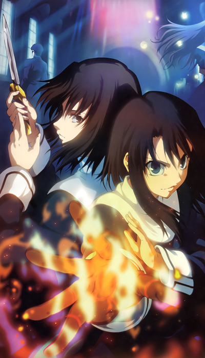
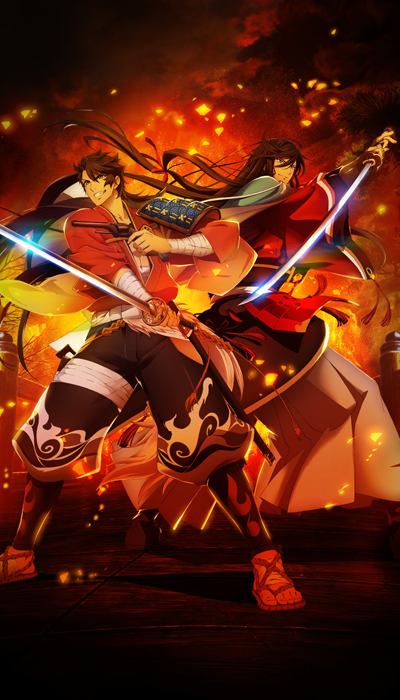
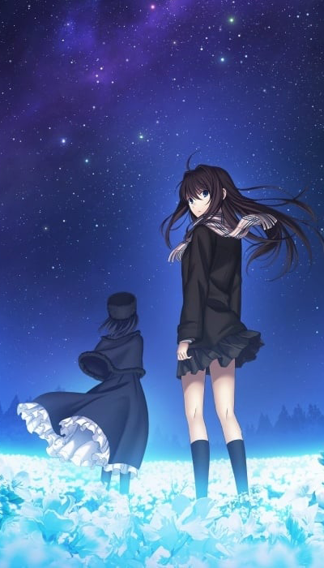

icon:material/update
# Status Updates

## To Do List (07/2024)

### Manual Review and Clean Up

!!! info "The following content in the current model is undergoing quality control and clean up:"
    * Fate Zero
        * *Episode 1-19 re-extracted, Episodes 1-3 and OP/ED 1 and 2 Completed, manual review and post work still in progress*
    * Fate Stay Night Unlimited Blade Works (TV)
        * *Episode 0-12 re-extracted, Episode 0-2 and OP/ED 1 and 2 Completed, manual review and post work still in progress*
    * Fate Stay Night Heaven’s Feel
        * *1 – presage flower: re-extracted, deduped and sorted, undergoing post-processing. manual review need*
        * *2 – lost butterfly: re-extracted, deduped and sorted, undergoing post-processing. manual review need*
        * *3 – spring song: re-extracted, duplicate removal and sorting in progress, some stitching completed*
    * The Garden of Sinners 
        * *8 – Epilogue: re-extracted, deduped and sorted, undergoing post-processing, manual review done*
        * *9 – Future Gospel: re-extracted, clean up in Progress, some stitching completed*
        * *9.5 Future Gospel – Extra Chorus: re-extracted, deduped and sorted, undergoing post-processing, manual review done*
    * Fate Stay Night [Réalta Nua]
        * *Opening Animations*
            * *re-extracted, deduped and sorted, undergoing post-processing. manual review need*
    * Fate/Hollow Ataraxia
        * *Opening Animations*
            * *re-extracted, deduped and sorted, undergoing post-processing. manual review need*

### Ready To Train

[{: style="width:170px"}](./images/todolist//full/knk6.jpg)
[{: style="width:170px"}](./images/todolist/full/tozx.jpg)
[{: style="width:170px"}](./images/todolist/full/ktrfull.jpg)
[{: style="width:170px"}](./images/todolist/full/tob.png)

!!! success "The following content will be included in the next training session - minimal manual edits only:"
    *   Movies
        *   The Garden of Sinners 
            * 3 – Remaining Sense of Pain
            * 4 – The Hollow Shrine
            * 5 – Paradox Spiral
            * 6 – Oblivion Recorder
            * 7 – A Study in Murder - Part 2
    *   TV 
        *   Katsugeki/Touken Ranbu
        *   Tales of Zestiria the X  (Season 1)
    *   Video Games
        *   Tales of Zestiria
            * *Opening Animations and Cutscenes*
        *   Tales of Berseria
            * *Opening Animations and Cutscenes*
        *   Tsukihime -A piece of blue glass moon-
            * *Opening Animations*
    *   Mobile
        *   Tales of Asteria 
            * *ufotable assets only*
        *   Tales of Crestoria
            * *ufotable assets only*

----

### In Progress

[{: style="width:170px"}](./images/todolist//full/tsukire.jpg)
[{: style="width:170px"}](./images/todolist/full/mahoyofull.png)
[{: style="width:170px"}](./images/todolist/full/tos.jpg)
[{: style="width:170px"}](./images/todolist/full/kny.png)

!!! example "The following will be included in a future session - not ready, not ufotable content, lower priority, or limited disk space"

    *   Artbooks
        *   [The Garden of Sinners: The Animation by Ufotable](./images/todolist/artbook/81WRhFUmhFL._SL1500_.jpg)
            * *Have physical source, needs to be scanned*
        *   [The Garden of Sinners: Complete Illustration Art Book by Takeuchi Takashi](./images/todolist/artbook/9784062186971_w.jpg)
            * *Have physical source, needs to be scanned*

    *   Movies
        *   The Garden of Sinners 
            * 1 – Overlooking View
                * *Have source media, not extracted*
            * 2 – A Study in Murder - Part 1: 
                * *Have source media, not extracted*
        *   Tales of Symphonia
            * *Have not finalized a source*
        *   Demon Slayer - Mugen Train
            * *Have not finalized a source*
    *   TV
        *   Tales of Zestiria the X (TV - Season 2)
            * *Have source media, not extracted*
        *   Today's Menu for the Emiya Family  
            * *Have source media, not extracted*     
        *   Demon Slayer
            * *Have not finalized a source*
    *   Video Games
        *   Tales of Xillia I
            * *Openings and cutscenes extracted, Not sorted*
        *   Tales of Xillia II
            * *Openings and cutscenes extracted, Not sorted*
        *   Witch on the Holy Night
            * *Not ufotable, assembling in-game sprites and CG assets*
        *   Tsukihime -A piece of blue glass moon-
            * *Assembling non-ufotable in-game sprites and CG assets*
    *   Mobile
        *   Fate Grand Order
            *   [The Garden of Sinners] crossover event
                * *ufotable assets and promotional animation only*
            *   [Fate Zero] crossover event
                * *ufotable promotional animation only*
            *   [Fate Stay Night - Heaven's Feel] movie premiere promotions
                * *ufotable assets only*

----

### TBD

!!! failure "Waiting on USM decryption for the following games to frame extract cutscenes"
    *   Video Games
        *   Tales of Arise
            *   *Have usm video files on standby*

!!! failure "Awaiting sale or alternate source for follow collections"
    *   Artbook
        *   ufotable 
            *   [The Garden of Sinners - Seikaisha (Background Art Book)](./images/todolist/artbook/91vngIKYgCL._SL1500_.jpg)
            *   [The Garden of Sinners - Future Gospel New Years Illustrations Postcards [Comiket 85]](./images/todolist/artbook/000.jpg)
                * *A scan of this exists online but what looks to be dust or fuzz on the images from when it was scanned is obscuring fine details.*
            *   [Fate/Zero - Seikaisha (Background Art Book)](./images/todolist/artbook/91NlW-xGcBL._SL1500_.jpg)
            *   [Fate/Stay night 'Unlimited Blade Works' - Seikaisha (Background Art Book)](./images/todolist/artbook/9784062198738_w.jpg)
            *   [Fate/Stay Night 'Unlimited Blade Works' S1 - Settei Shiryoushuu (Setting Material) [Comiket 87]](./images/todolist/artbook/55C0AAA247644B001F.jpg)
            *   [Fate/Stay Night 'Unlimited Blade Works' S2- Settei Shiryoushuu (Setting Material) [Comiket 88]](./images/todolist/artbook/55C0AA9F470499000C.jpg)
            *   [Fate/Stay Night 'Unlimited Blade Works' Character Complete Key Animations [Comiket 87, 88, 89]](./images/todolist/artbook/55C0AA924A17CD0025.jpg)
                *   *There's 10 of these, very low priority in seeking out product or scans of it other than to obtain it's included lineart image. [#1](./images/todolist/artbook/686658.jpg), [#2](./images/todolist/artbook/678218.jpg)*

!!! failure "Waiting on releases for the following Ufotable Media:"
    *   Movies
        *   Witch on the Holy Night
            *   *Have rips of the trailers for quality source testing on standby: [#1](https://www.youtube.com/watch?v=OujIyh_h-M4), [#2](https://www.youtube.com/watch?v=IqUZ6y6ldeA)*
    *   TV
        *   Untitled Genshin Impact Animation
            *   *[Have rip of trailer for quality source testing on standby](https://www.youtube.com/watch?v=V07G0_PE2CE)*
    *   Mobile
        *   Honkai Starrail 
            *   *[Fate Stay Night - Unlimited Blade Works] crossover event*

----