icon:material/pipe
# Pipeline Workflow

## Modifying a preset repo to handle an unexpected developments

After several successful model trainings, I had become dissatisfied with the quality of the dataset I originally produced with [Anime Screenshot Pipeline](https://github.com/cyber-meow/anime_screenshot_pipeline). It had some short commings with the quality of data and some steps and scripting were unnecessary for what I needed. Through repurposing and editing some of tools and scripts, I began redoing the entire dataset from once I got comfortable with the entire training process. By the time I reached my current workflow and results, my pipeline workflow looks unrecognizable to even the developer's current version of the process. There is some more manual steps involved but not from lack of ability, but rather the need of human supervision in so places where automation is not yet up to the task.


!!! info "Things to note before continuing:"
    
    * Anime is usually broadcasted in 24 frames per second, drawn in 3s. Meaning every drawing is on screen for 3 frames, 8 different frames shown in a second.

    * A standard anime episode is 24 minutes long, or around 34k frames
    
    * A standard film of 2 hours is around 170k frames
    
    * Each frame when exported through ffmpeg is around 1.5MB-3MBs in size
    
    * This makes the size of frame extractions 300GBs for a single episode and 1.5TB for a movie. 
    
    * A manually cleaned up episode will come down to about 50GBs in size and a movie will drop to around 600GB, but takes about a days worth of work.
    
    * Very large Hard Drive space required

## Frame Extraction 

The first change I made to the pipeline was the [`ffmpeg`](https://www.ffmpeg.org/) script provided. The Pipeline used a script that would run the mpdecimate command to remove duplicate or “frozen frames”, moments in the animation where there is no movement, as `ffmpeg` is “extracting” the frames to condense down the frames to a final output around one tenth of the original size. Then a secondary filter using a computer vision model through a Jupyter script using `FiftyOne` would do one last sweep of any frozen frames mpdecimate would've missed to reduce the file size even further.

[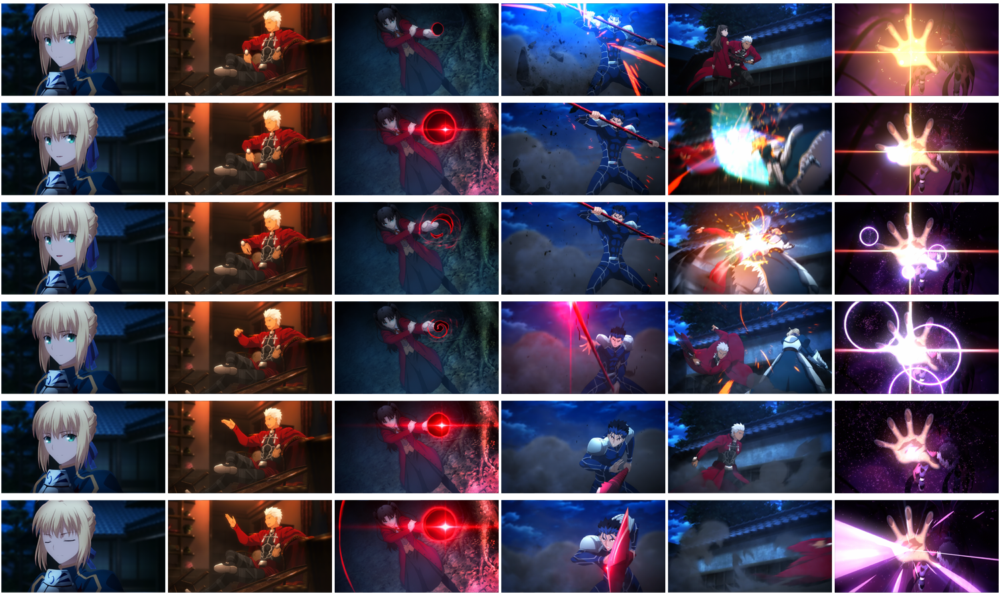{: style="width:680px"}](./images/Pipeline/Frame Extraction Header.png)

However, I came to find out much later there was a large spread of false positive frame removals for unknown reasons, and false negatives of frames that were kept from a combination of mpdecimate not considering jump cuts that repeat scenes after several cuts, and FiftyOne failing the second filter due to the Blu-ray encodings introducing enough pixelation changes between frames that it would defeat both filters' deletion threshold. 

```
ffmpeg -hwaccel cuda -i "video.m2ts" "Name_EpisodeNumber"_%d.png
```

Because the loss of data was too significant to ignore, I stopped using mpdecimate and let ffmpeg run the simple command above to extract every single frame in full. Then instead of using the FiftyOne's CV, I began using a [script by space-nuko](https://github.com/space-nuko/sd-webui-utilities/blob/master/tagtools.py) that would sort the "forzen frames" based on the image file's hash value and would only move all the flagged frames to a different folder and not delete the rest of the images, allowing for manual review in the future. 

```
python tagtools.py -r dedup "\path\to\folder"
```

[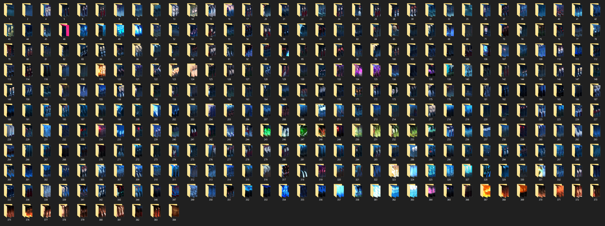{: style="width:680px"}](./images/Pipeline/scene folders.PNG)

<span style="font-size: 80%;">*340 folders that will have its content sorted, this episode (Unlimited Blade Works, Ep 3) had 384 total unique jump cuts, the rest had usable data or are in different sorting folders for [stitching and cropping](datasetpostprocess.md/).*</span>

The downside to this new method is that increased use of hard drive space from not just more images, but the file size was doubled or tripled in some cases. Mpdecimate's outputs were shrinking the .png file size to under 1MB, and ffmpeg on it's own does not have settings to reduce file sizes without destroying the pixelation of the output. 

This situation would force me to start buying hard drives and to looking into NAS solutions to hold all this data, but it did also present a way to schedule when to start manual reviewing the datasets, as this would free almost enough space to frame extract another episode and give some breathing room before going out to buy more storage.

## Tagging

Stable Diffusion base models use CLIP captioning to tag their datasets with natural language for prompt keywords. NovelAI’s anime finetune of SD1.4 instead used English based Japanese imageboard site Danbooru’s key word tagging format for prompting instruction. This is because Novel AI's parent company, Anlatan, scrapped Danbooru's site for all the images used in the training of their model, and used their metadata as the standard for prompting their model. Because it seemed that keyword prompting performed better than just pure natural language, and the tool creators made popular tools for anime trainers based on NovelAI's content, future dreambooths, LoRA networks, and other checkpoints types followed this format for not just anime, but realism models as well.

[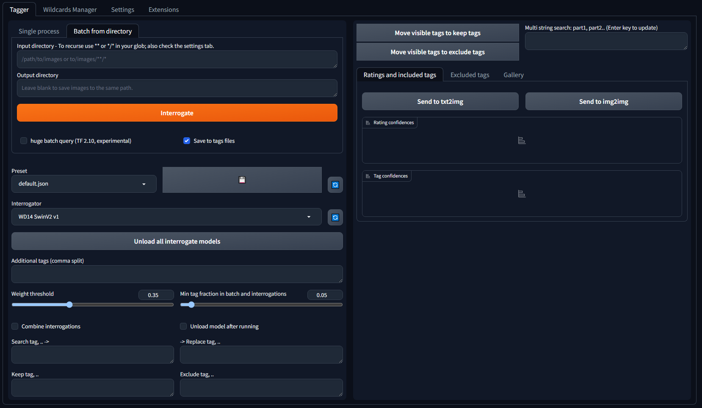{: style="width:680px"}](./images/Pipeline/tagger menu.PNG)


I initially used the built in Automatic1111 tagger when starting out making Textual Inversions and LoRAs and worked fine for the standard images you would find on the internet. It will generate a sidecar text file that will be read by the trainer to associate the metadata with the image. The problem comes when working on 16:9 images, as all the classifiers out in the wild were trained mostly with either 1:1 aspect images due to SD1.x early on requiring 512x512 data, or whatever sizable collection of images trainer could collect in other resolution sizes for regularization. 

The 16:9 ratio confused the classifiers and generate an absurd amount of false positive tagging of character subjects onto all sorts of images that were not character focused; a scenery shot, item focus shots, transitioning scenes, logos and texts, panning of the environment before a subject walks into the shot, a magical explosion on screen. This incorrect info would result in generations where the subject would not appear in the image, or would appear fused into parts of a scenery, special effects shots, or just shots of empty hallways and unprompted backdrop focused images. 

??? Warning "Examples of the mistagging problem from a 02/2023 finetune attempt:"
     <span style="font-size: 95%;">*Yea I don't think these were normal...*</span>

    [{: style="width:329px"}](./images/Pipeline/busted/1.png)
    [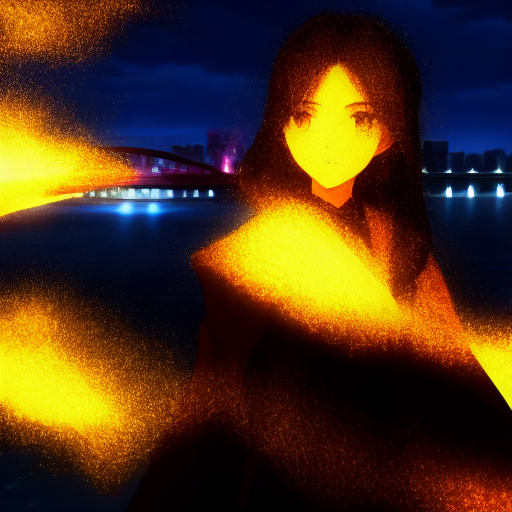{: style="width:329px"}](./images/Pipeline/busted/2.png)
    [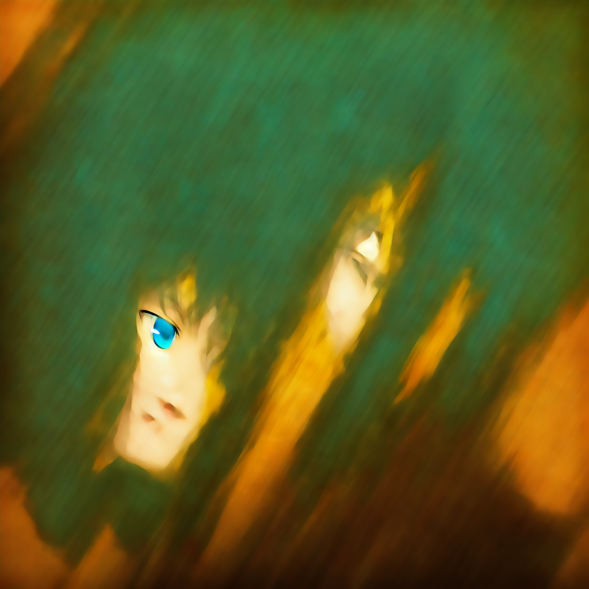{: style="width:329px"}](./images/Pipeline/busted/3.png)
    [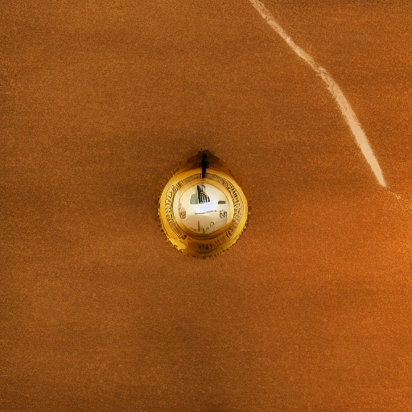{: style="width:329px"}](./images/Pipeline/busted/4.png)
    [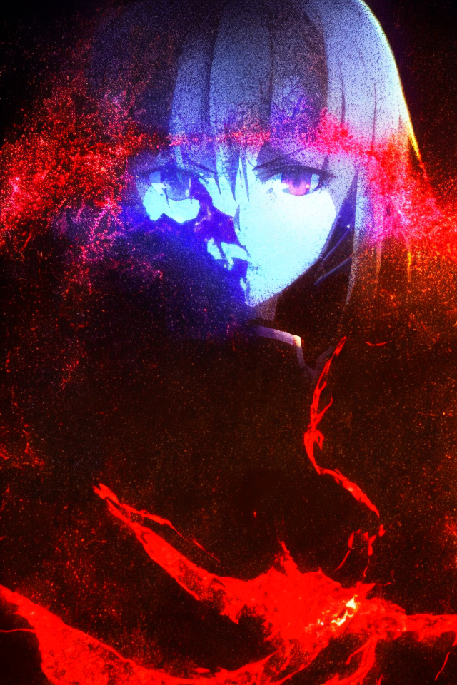{: style="width:329px"}](./images/Pipeline/busted/7.png)
    [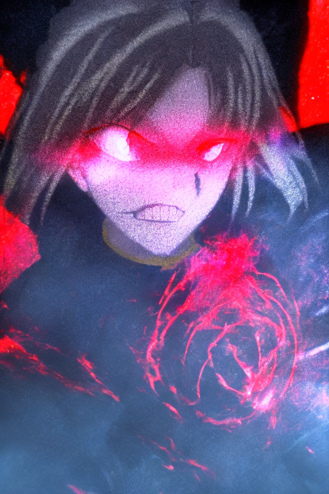{: style="width:329px"}](./images/Pipeline/busted/6.png)

### Face Detector for fixing character tags

The solution I came up with was repurposing the [anime face detection tool](https://github.com/hysts/anime-face-detector) used in the original pipeline github to detect passable images and generate 1:1 crops for a dataset. Per the github, "The model detects near-frontal anime faces and predicts 28 landmark points." Meaning that it will use these data points to detect faces on all images in a directory and give each image a scoring threshold, of which it will give it a passing detection or no. I modified the script to have it produce duplicates of all images that pass the face detection threshold into a different folder instead of creating cropped images. These images will be imported after the inital dataset import to my image organizer, Hydrus, is completed. I will delete all the subject tags from those initial images and then import the copied images with the accurate subject tags and it will update the ones already on file. 

[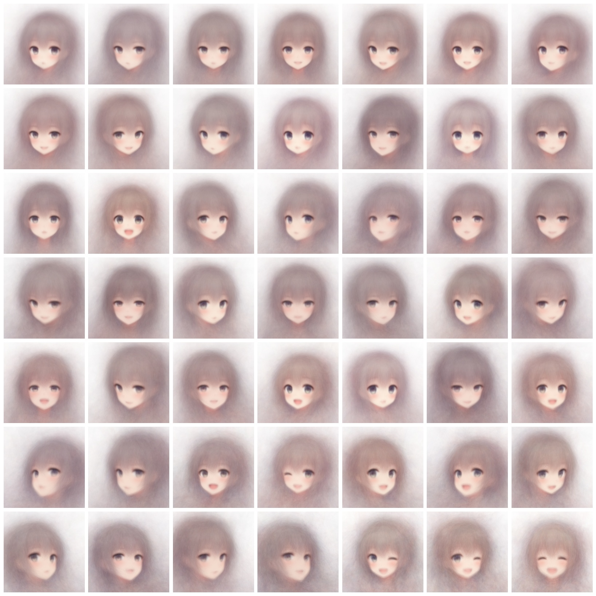{: style="width:340px"}](./images/Pipeline/cluster_mean.jpg)
[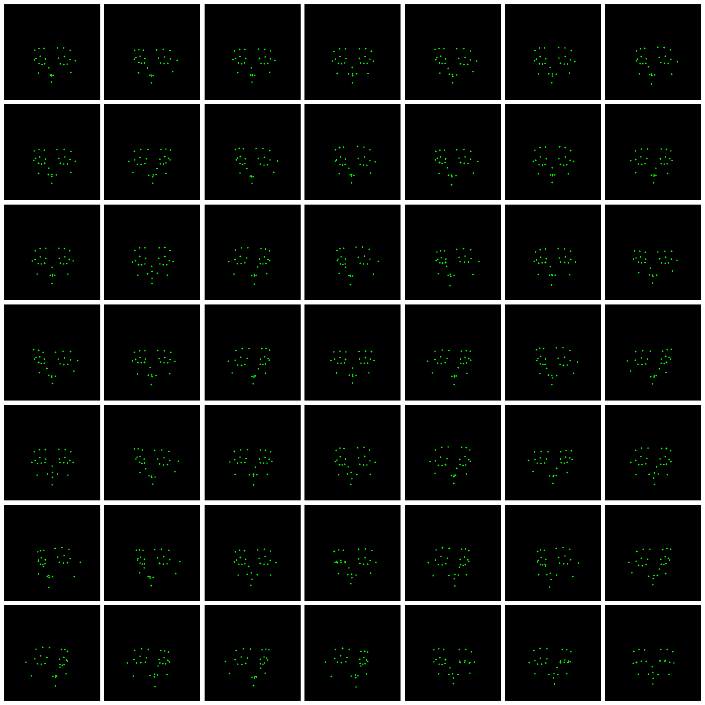{: style="width:340px"}](./images/Pipeline/cluster_pts.png)

<span style="font-size: 80%;">*Images from Hysts' anime face detection tool github*</span>

My first training after using this method instantly fixed the prompting of subjects. A quick skim of the images that passed the face detection threshold show no signs of false positives, and there is no issue if there are cases of false negatives, as manual review will take care of anything that were missed. Other miscellaneous improves I used for this phase include an autotagger aggregate that will tag based on the average of 3 or more classifiers running concurrently and has the tagging of copyright names removed just so that I reduce false positive tags of characters that don’t belong in the content from being erroneously introduced. 

## Dataset Organization and Preparation

### Hydrus

While dedicated image organizers for stable diffusion datasets are available, I elected with using an obscure desktop application called [Hydrus Network](https://hydrusnetwork.github.io/hydrus/index.html). Created in the early 2010s for the purpose of organizing large media collections (of internet memes and other s#!tposts) under a single location with various customizable categories coincidentally modeled after the format of imageboards such as Danbooru. The media is tabulated based on file hash rather than whatever the file is named as. This aspect synergizes not only with how the datasets need to be tagged if following the Booru/NovelAI format, but with how my organization scripts operates on file hash values when sorting unique frames out, as well as how I incorporate face detection copies of images with correct subject tagging.

[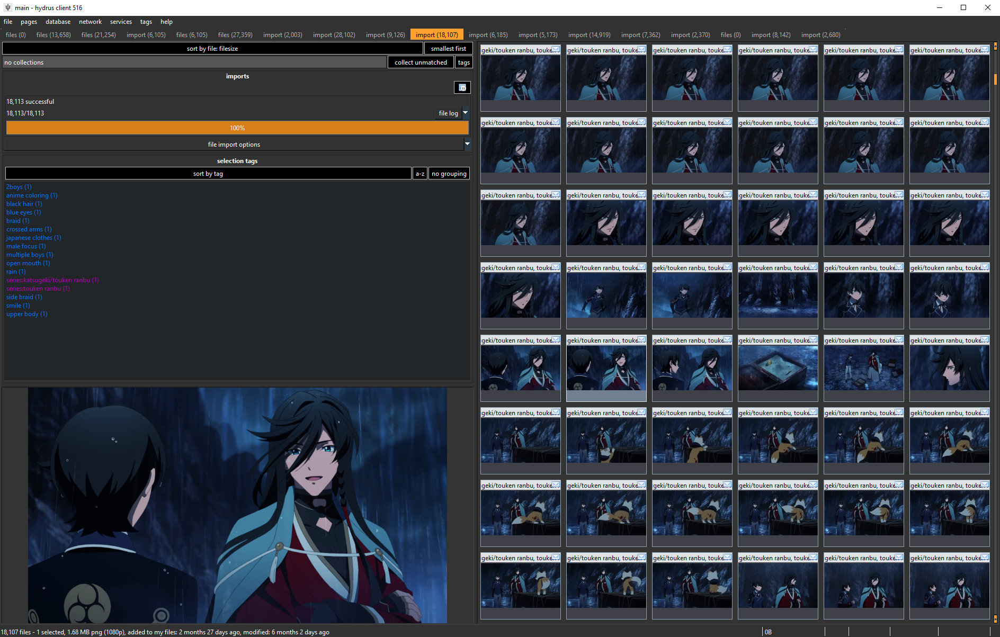{: style="width:680px"}](./images/Pipeline/Hydrus3.png)

<span style="font-size: 80%;">*Main View of Hydrus*</span>

Once my sorted and auto tagged images are completed, I will import the dataset batch into Hydrus and it will associate the tag sidecar txt files generated by the taggers to the images and will automatically populate the datapoints hits. I also include Hydrus specific metadata of the series, episode, and scene for later manual review once the import is finished.

Once the first import is complete, I will select the entire batch and edit their tag information to remove all the subject tags (1boy/1girl and other variations of multiple of each for example) in a single click, and then import the copied images from the face detection step. Since the copies have the same hash value, the only thing that will change is that the sidecar txt values will update to include any new values and will not replace any changes I may have already made. Once the subject values have been reintroduced, I will then delete those copies, but will keep the originals of the first import as they will still be required in the future.

[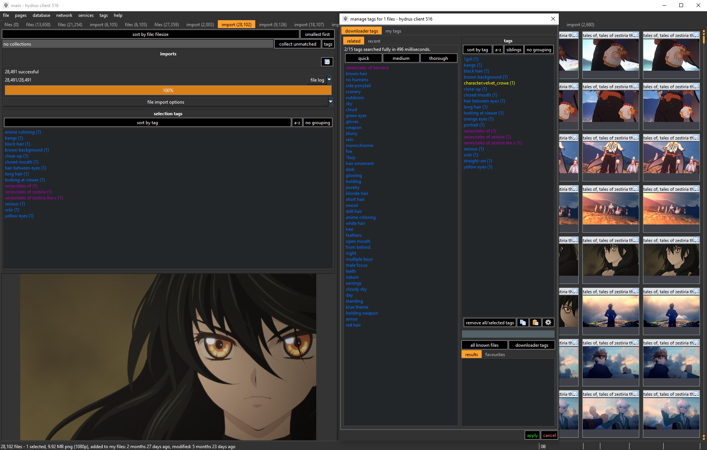{: style="width:680px"}](./images/Pipeline/Hydrus4.png)

<span style="font-size: 80%;">*Bottom left previewed image, its current tags above, and tag panel on right with manual corrections ready to apply*</span>

From here I can proactively check any tags I may have previously had issues with and search for all images by that tag, remove tags if incorrect, maybe even delete images that could be seen as bad data, and overall just skim that the frames I did get were satisfactory.
I will repeat this process with all new dataset batches I make until the model is ready to train. From here I can use the Hydrus metadata I included to only select a specific range of data that is ready to go and it will export a new set of copies with sidecar txt files that the trainer will need to associate the tags and images.

## Kohya Trainer

!!! info "Things to note before continuing:"

    * Card used for training with Kohya SD-Script is a water cooled RTX4090 MSI Suprim Liquid X on my personal machine.
    
    * Training 200k Images at 512x512 resolution at batch size 16 takes 48 hours. 
    
    * Projected Training of 400k images at 768x768 resolution at batch size 1 is 120 hours based on a fellow trainer who trained a similar configuration with a 16GB Google TensorGPU on the cloud, with approximately 168 hours if trained at 1024x1024 over SD1/NAI. 
    
    * From a test I already tried a 768 resolution, batch size at 16 down to 14 caused a CUDA Out of memory error within minutes of training start and then requires a PC restart. Have not tried again with the current pending training data size as I decided to focus on prepping the dataset
   
    * SDXL training requires even more memory to accurately finetune the model, outside the scope of my hardware.
    
    * While training the model, I cannot perform any other GPU based tasks on my machine or risk causing an Out of Memory error. It also gets very hot.
    
    * Due to the above, I focused more on gathering the dataset and do as much quality work as I could before committing to a very lengthy training session.

Japanese developer Kohya-SS’s SD Script package is an old but very consistent way training package. While it mostly supports LoRA and other network-based checkpoint trainings, it still supports full finetune support for SD1 models. It only needs to be pointed to a training directory, will check the main training folder and the regulation folder if enabled, and will then just follow the training parameters set in the powershell script and output the checkpoint when done. 

[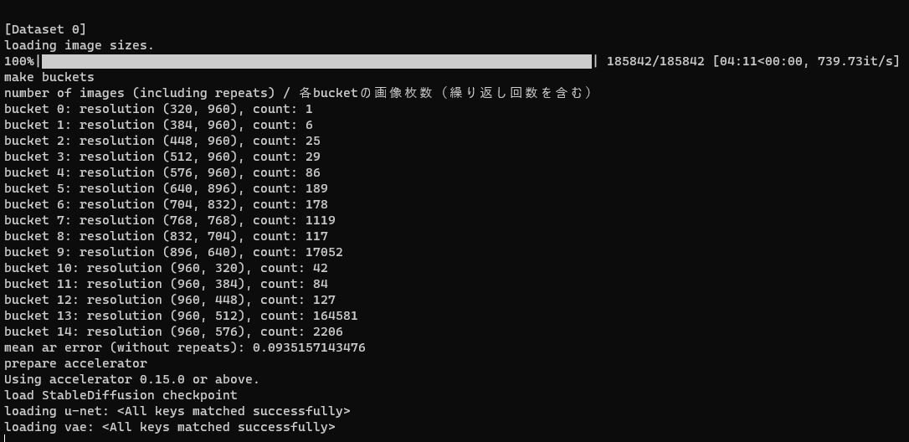{: style="width:680px"}](./images/Pipeline/sdbuckets.JPG)

<span style="font-size: 80%;">*Kohya SD-Script running the aspect bucket step for 768x768 resolutions right before training begins, processing 185842 images for this session*</span>

The default training settings are borrowed from the NAI training settings and includes the aspect ratio bucketing so the resolution sizes are not restricted to 1:1 aspect image, but resolution size will be dictated by hardware used for training so its defaulted to 512x512 but can be adjusted to be higher such as 1024x1024 like SDXL.

## Post Training Review
After the model is trained, I will run several “templates” to test changes between a previous version of the model compared to the current one. I will note if there are any visual improvements, changes in the look of backgrounds, character feature consistencies, detail in non-upscaled generations, and if any errors I caught in the previous cycle were fixed. 

[{: style="width:226px"}](./images/Pipeline/v7.png)
[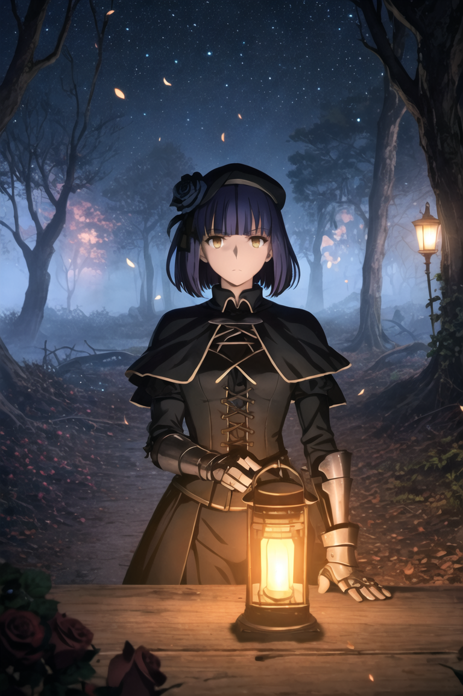{: style="width:226px"}](./images/Pipeline/v8.png)
[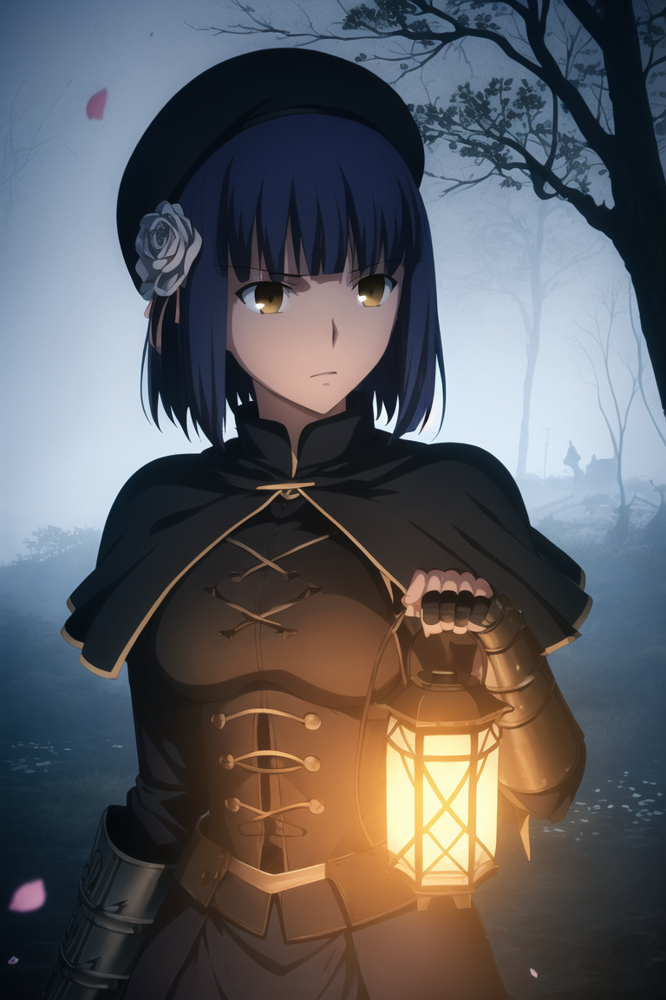{: style="width:226px"}](./images/Pipeline/v9.png)

<span style="font-size: 80%;">*Same seed, varied results as dataset arrangement is updated through Alpha v7, v8, and v9 respectively.*</span>

Per the example, you can see that v8's default frame changed quite a bit to portray the subject farther away or smaller. After some tag correction in the the image composition category (Portrait/Face, Upper Body, Cowboy Shot, Full Body, etc) and some new data with preemptive composition tagging, as well as [new cropped image](datasetpostprocess.md/#cropping) with facial close ups, we nudged back close to the v7 perspective with fuller face detail although the subject is not resting the lantern anymore on a foreground surface. It won't always be a similar frame or pose match when try to improve the dataset's quality or concept understandings, but we can correct unexpected behaviors when they surface and do fine tweaking along the way.

Along with testing my own seeds and settings, I will also take prompts of other stable diffusion images I see in the wild to test how others would prompt on this model in hopes of finding tags prompts that don’t aren’t producing intended results so I can then note down to check on Hydrus. 
