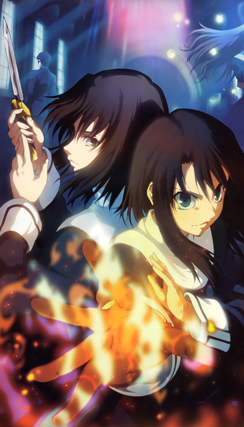
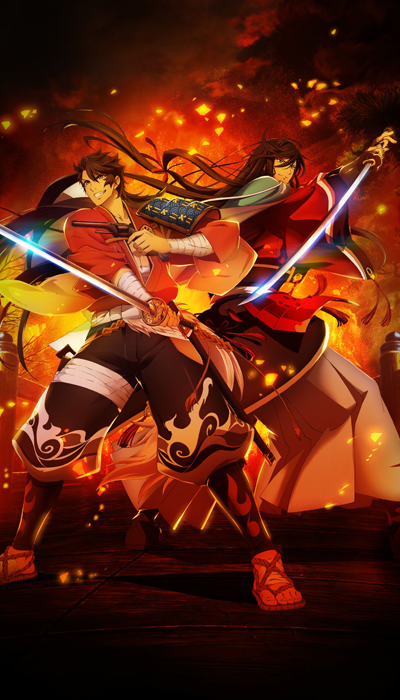
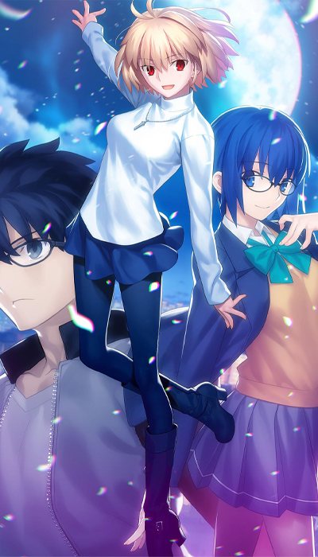
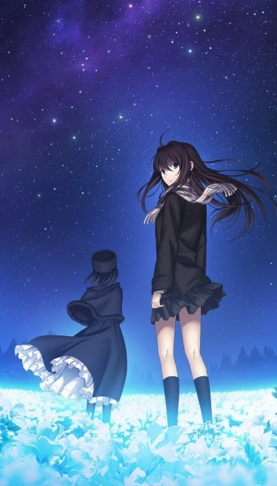

icon:material/update
# Status Updates

## To Do List (07/2024)

### Manual Review and Clean Up

Ongoing progress of dataset's quality control and clean up:

!!! success
    * Fate Zero
        * Episode 1-19 re-extracted, Episodes 1-3 and OP/ED 1 and 2 Completed, rest in progress
    * Fate Stay Night Unlimited Blade Works (TV)
        * Episode 0-12 re-extracted, Episode 0-2 and OP/ED 1 and 2 Completed, rest in progress
    * Fate Stay Night Heaven’s Feel
        * Movies Re-extracted, Movie 1 and 2 have clean up and stitching finished, 3 still need clean up.
    * The Garden of Sinners 8 – Epilogue
        * Re-extracted - Dedup complete, Stitching Complete, Final cropping in progress
    * The Garden of Sinners 9 - Future Gospel
        * Re-extracted - Manual review and clean up in progress
    * The Garden of Sinners 9.5 - Future Gospel: Extra Chorus
        * Re-extracted - Dedup complete, Stitching Complete, Final Cropping in Progress
    * Fate Stay Night [Réalta Nua]
        * Re-extracted - Dedup complete, Stitching Complete, Final cropping in progress
    * Fate/Hollow Ataraxia
        * Re-extracted - Dedup complete, Stitching Complete, Final cropping in progress

### Ready To Train

[{: style="width:188px"}](./images/todolist//full/knk6.jpg)
[{: style="width:188px"}](./images/todolist/full/tozx.jpg)
[{: style="width:188px"}](./images/todolist/full/ktrfull.jpg)
[{: style="width:188px"}](./images/todolist/full/tob.png)

Ready to train on next session - minimal manual edits only:
!!! example
    *   Movies
        *   The Garden of Sinners 3 – Remaining Sense of Pain
        *   The Garden of Sinners 4 – The Hollow Shrine
        *   The Garden of Sinners 5 – Paradox Spiral
        *   The Garden of Sinners 6 – Oblivion Recorder
        *   The Garden of Sinners 7 – A Study in Murder - Part 2
    *   TV 
        *   Katsugeki/Touken Ranbu
        *   Tales of Zestiria the X  (Season 1)
    *   Video Games
        *   Tales of Zestiria
        *   Tales of Berseria
    *   Mobile
        *   Tales of Asteria (Only Ufotable Assets)
        *   Tales of Crestoria (Only Ufotable Assets)

----

### In Progress

[{: style="width:188px"}](./images/todolist//full/tsukire.jpg)
[{: style="width:188px"}](./images/todolist/full/mahoyofull.png)
[{: style="width:188px"}](./images/todolist/full/tos.jpg)
[{: style="width:188px"}](./images/todolist/full/kny.png)

In the pipeline but not ready due to priority, not directly ufotable content, or limited hard drive space

!!! example
    *   Movies
        *   The Garden of Sinners 1 – Overlooking View
        *   The Garden of Sinners 2 – A Study in Murder - Part 1
        *   Tales of Symphonia
        *   Demon Slayer - Mugen Train
    *   TV
        *   Tales of Zestiria the X (TV - Season 2)
        *   Today's Menu for the Emiya Family        
        *   Demon Slayer (4 Seasons)
    *   Video Games
        *   Tales of Xillia I
        *   Tales of Xillia II
        *   Witch on the Holy Night
        *   Tsukihime -A piece of blue glass moon-

----

### TBA

Waiting on USM decryption for the following games to frame extract cutscenes
!!! failure
    *   Tales of Arise (VG)

----
Waiting on releases for the following Ufotable Media:
!!! failure
    *   Witch on the Holy Night (Movie)
    *   Honkai Starrail x Fate Stay Night Unlimited Blade Works (Mobile)
    *   Untitled Genshin Impact Animation (TV)

----